# JHMR's User manual 
The pourpose of this manual is to answer user questions and present the correct use of the tool together with the joystick for hand exercises. 

Use the index bellow to navigate between sections. 

- [JHMR's User manual](#jhmrs-user-manual)
  - [Supported platforms](#supported-platforms)
  - [Installing and running](#installing-and-running)
  - [General notes about the use](#general-notes-about-the-use)
  - [Joystick connection](#joystick-connection)
  - [Calibration](#calibration)
  - [Button configuration](#button-configuration)
  - [Game config profile](#game-config-profile)
  - [User actions](#user-actions)
  - [User statistics](#user-statistics)

## Supported platforms
This tool works exclusively on the Windows operating system 

## Installing and running
The tool does not need to be installed, you only need to extract the downloaded file. 

For this, the [7Zip](https://www.7-zip.org) tool is recommended, tho other tools will work fine. 

   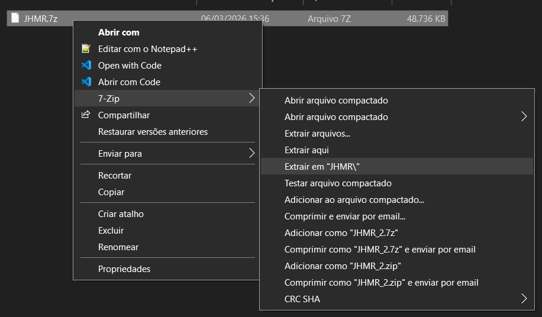

**To use the tool:** 
1. Access the folder "main"
2. Open the tool by double clicking the executable named "JHMR.exe"

## General notes about the use
1. In multiple functions, the screen of the tool will be grayed out and will be blocked, meaning they can't be used.
   1. This is made so conflicting operations are not executed at the same time.
   2. Wait for the current function to complete so the tool can resume operation.

## Joystick connection
**OBS:** Is important to remember that connections to the device should only be made through the tool and not to the Windows bluetooth interface. The tool can only detect the joystick when the connection is made through it.

The connection manager is the first screen that appears when opening the tool. Other functions can't be executed if the joystick has not been properly connected. 

   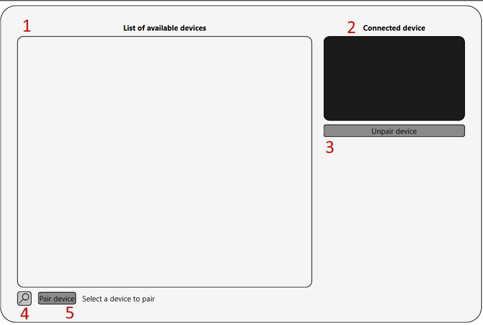

The image above represents the connection manager screen with it's main elements numbered. 

1. Device list
   1.  Updated after clicking search device button.
   3.  Click on a listed device to select it for pairing.
   4.  Turned off devices can also appear on the list but receive the "turned-off" status, and can't be interacted with.
2. Connected device
   1.  When no device is connected, the frame is grayed out.
   2.  When a device is connected, its informations are presented and the frame gets orange.
3. Unpair device button
   1.  Unpairs the currently connected device. 
   2.  Can only be done if a device is connected.
4. Magnifying glass
   1.  Searches for available devices.
5. Pair device
   1. Pair the selected device from the list.

Use the magnifying glass button to find devices. After pressing it, we get the following screen. 

   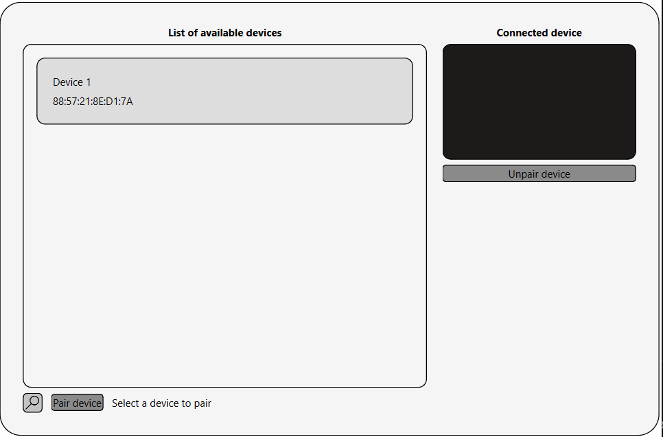

More than one device can appear on the list. 

To continue the connection process, click on the listed device. The screen will look like this. 

   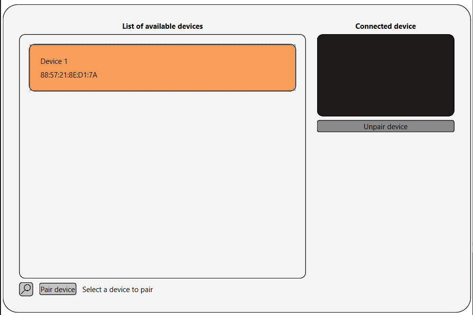

Now the pair device button can be clicked.  

After clicking the pair device button and waiting for the process to conclude, the connection screen presents the device on the previously grayed out is now orange. 

   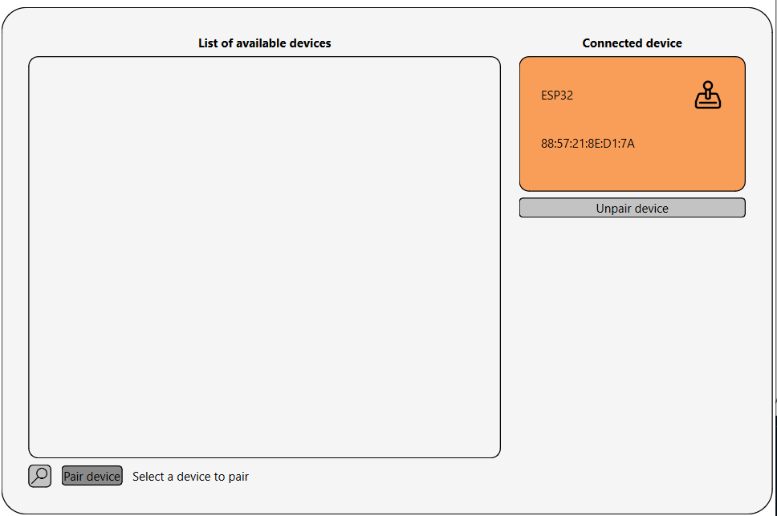

## Calibration

The calibration function is used to measure the user's respiratory strength through the joystick. 

The screen has three buttons and instructions on how to take the measurements. The whole process is composed by two measuring steps and a presentation step, that shows the results. 
The image below presents the calibration screen with it's elements numbered. 

   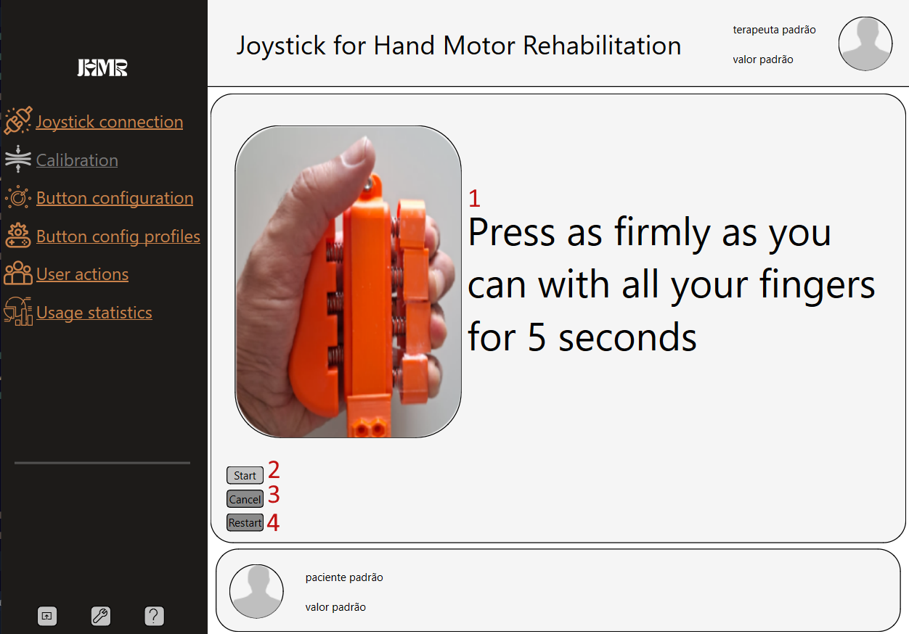

1. Instructions
   1. Image and text that presents the instructions for the current step.
2. Start
   1. Used to start the calibration process, sending a command to the joystick, signalling that the tool is ready to receive pressure information from the device.
3. Cancel
   1. Interrupts the calibration process. The current step is canceled and information is discarded.
   2. Will only the current step, the information from the previous step are kept.
   3. Can only be used during a calibration step.
4.  Restart
    1.  Clear collected data and returns to the start of the calibration process.

Second calibration step. 

   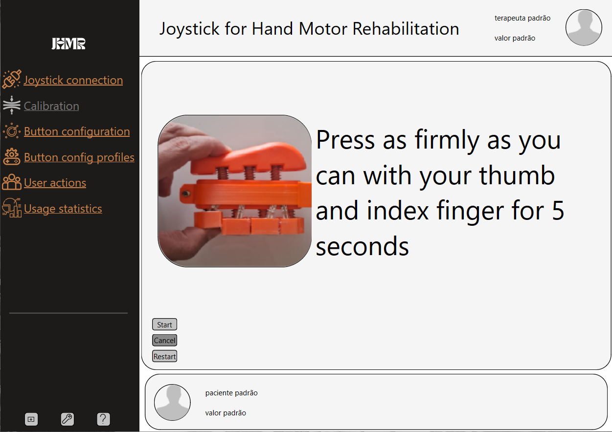

Calibration results. 

   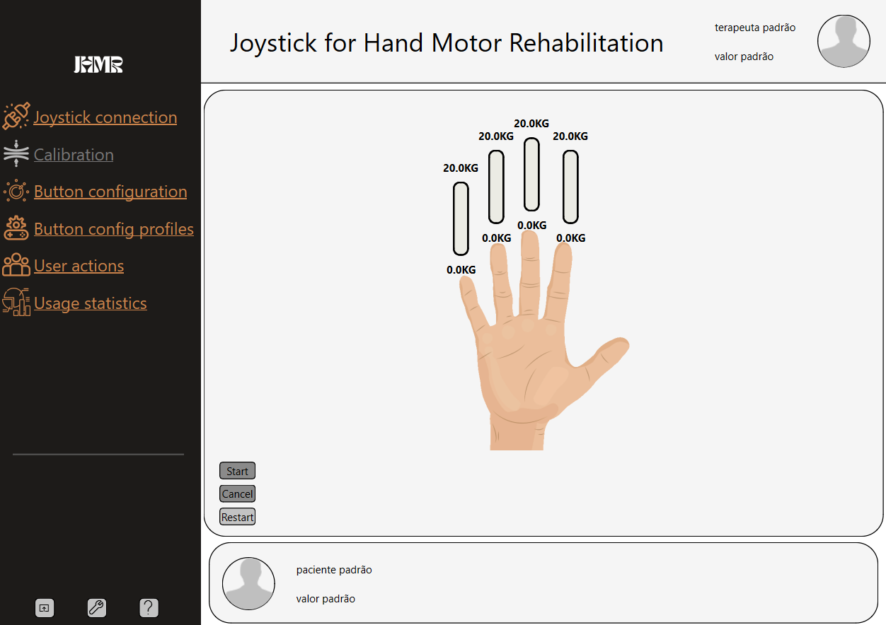

The pressure is measured in KG. The bars display the value in relation to the maximum suported, 20 KG. 

Tool during the calibration process 

   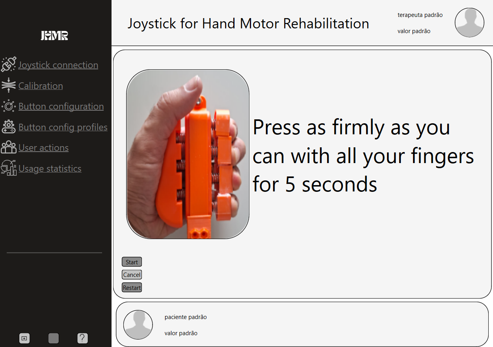

As [said before](#general-notes-about-the-use), other functionalities are blocked during calibration.

## Button configuration
The button configuration screen is used to associate a keyboard key to a combination of buttons and other parameters like pressure and activation time. 

   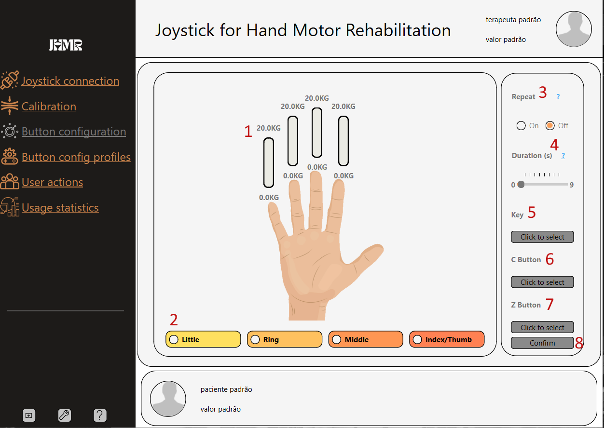

The above image presents the screen with it's main elements numbered. 

1. Pressure controls
   1. This group of sliders allows the user to assign a pressure value to the desired finger combination.
   2. Values are measured in KG, with the maximum being 20 KG.
   3. To enable a slider, select the finger using the finger selector radio buttons (Item 2).
   4. It's possible to use the keyboard arrow keys or mouse scroll wheel to to alter the pressure value, tho the user needs to click on the slider first.
2. Finger combination selection buttons
   1. Choose one or more fingers to be associated with the selected key using these buttons.
   2. The user needs to select at least one finger for the other functionalities of this screen to be enabled.
   3. By deselecting every finger, the screen returns to it's default state.
3. "Repeat" Radio buttons
   1. This button varies between turned-on and off.
   2. When turned-on, the selected key will be repeated when the user executes the exercise associated to it.
   3. If turned-off, the key will only be activated once per exercise.
4. Duration slider
   1. Used to choose the amount of time of continuous pressure needed to activate the key.
   2. Measured in seconds.
   3. 0 is the minimum, activating the key immediately after the patient does the desired action.
5. Key select button
   1. Button that allows the user to select the key to be associated with the desired finger combination.
   2. When clicking, a key selection dialog will appear.
   3. After selecting a key, the text of the selected key will appear on the button.
   4. After confirming the configuration, the text on the button reverts to the default "click to select".
6. C Button key select
   1. Allows the user to select a key to be associated with the C button of the joystick Nunchuk.
   2. Works identically to the key select button.
   3. The select key will keep being displayed even after a successful configuration. This is also true for button 7. 
   4. The Z and C key are configured independently of the finger combination and pressure.
7. Z Button key select
   1. Same functionality as button 6.
8. "Confirm" Button
   1. Sends the parameters of configuration to the joystick.
   2. After sending the configuration messages, presents a dialog window with a message of success or failure.
   3. Returns the screen to it's initial state.

The image below represents the key select dialog.

   

1. Use the keyboard to select a key.
2. After the choice is made, click on the OK button.

**As an example, let's associate the combination of little finger and middle finger with the A key.**
**The parameters are:**
1. A pressure of 3.0 KG for the little finger;
2. A pressure of 2.0 KG for the middle finger;
3. 1 second of duration for the activation;
4. Turned on repetition;
5. B and C keys assigned to the C and Z Nunchuk buttons.

The following images represent the step by step process. 
First, select the desired finger combination using the named buttons and assign the pressure using the sliders.

   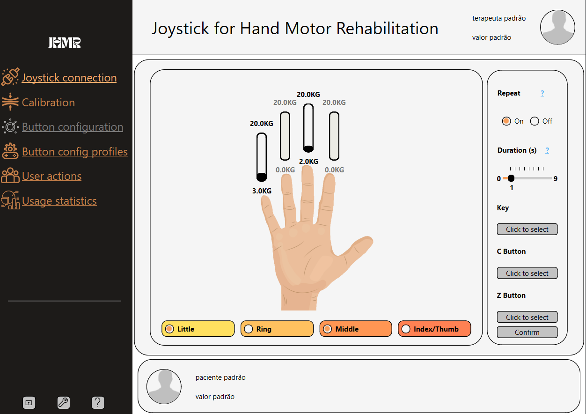

Assign the selected key.

   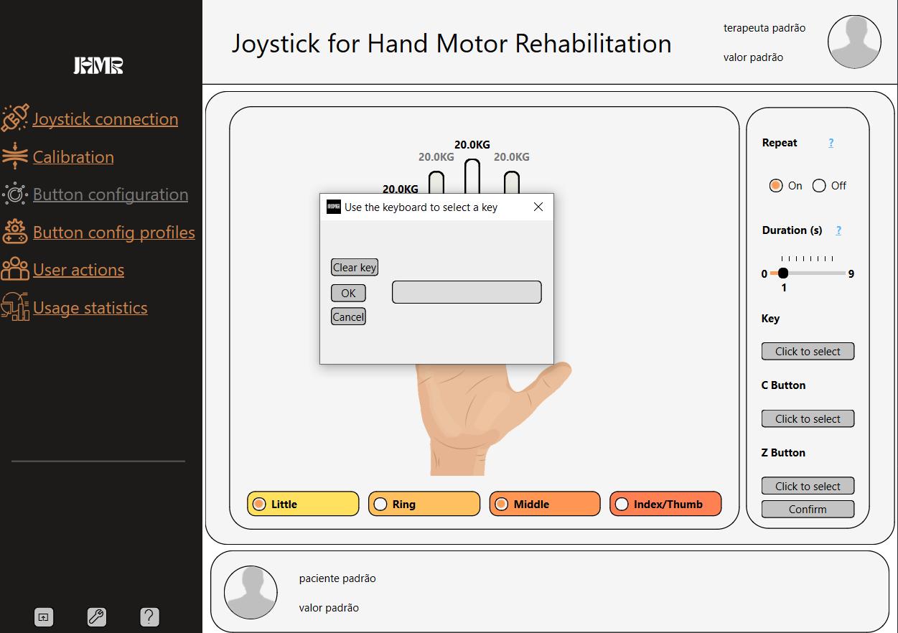

   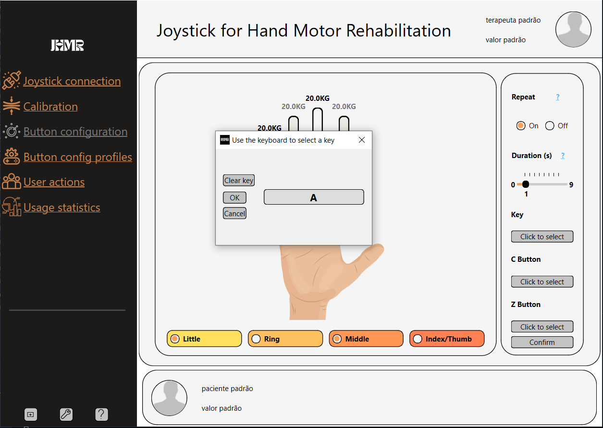

Finally, assign the repetition and duration parameters.

   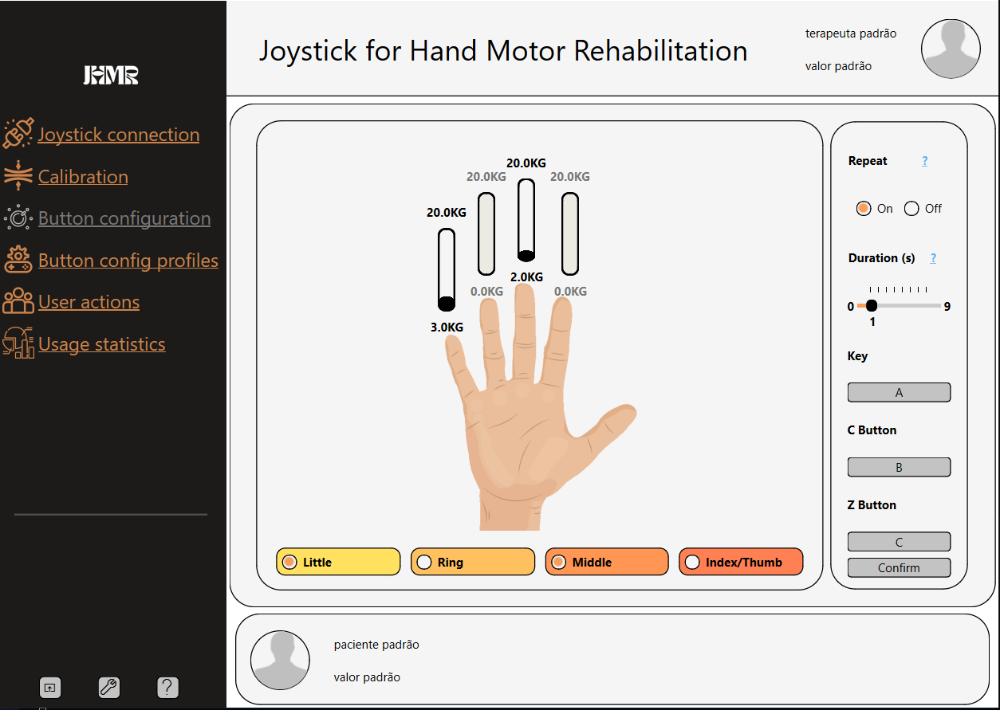

The configuration is finalized.

   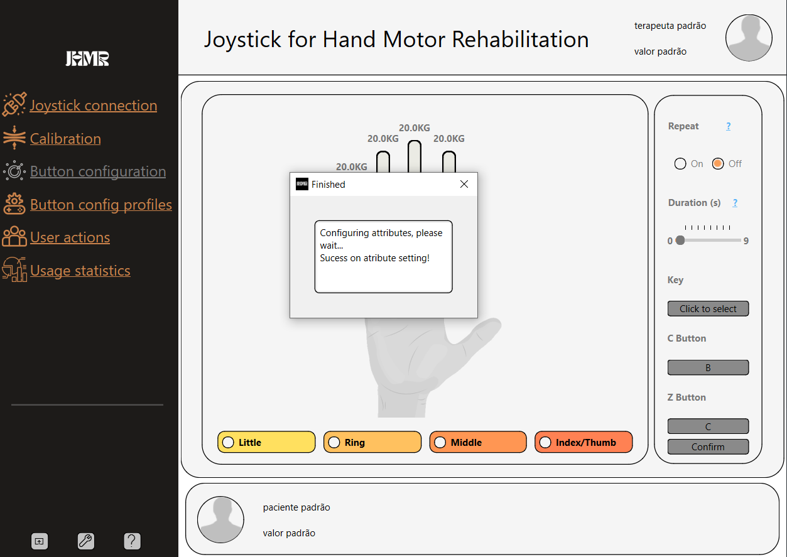

At this point, the screen returns to it's initial state and the user can make a new configuration.

## Game config profile
A function that allows the user to store multiple joystick configurations in a profile. These profiles are separated by patient and store joystick configurations individually, allowing the user to apply all of them with a single click. 
The objective of this screen is to speed up the process of configuring a joystick for a recurring patient, that practices the same exercise with the same game in multiple sessions. 

   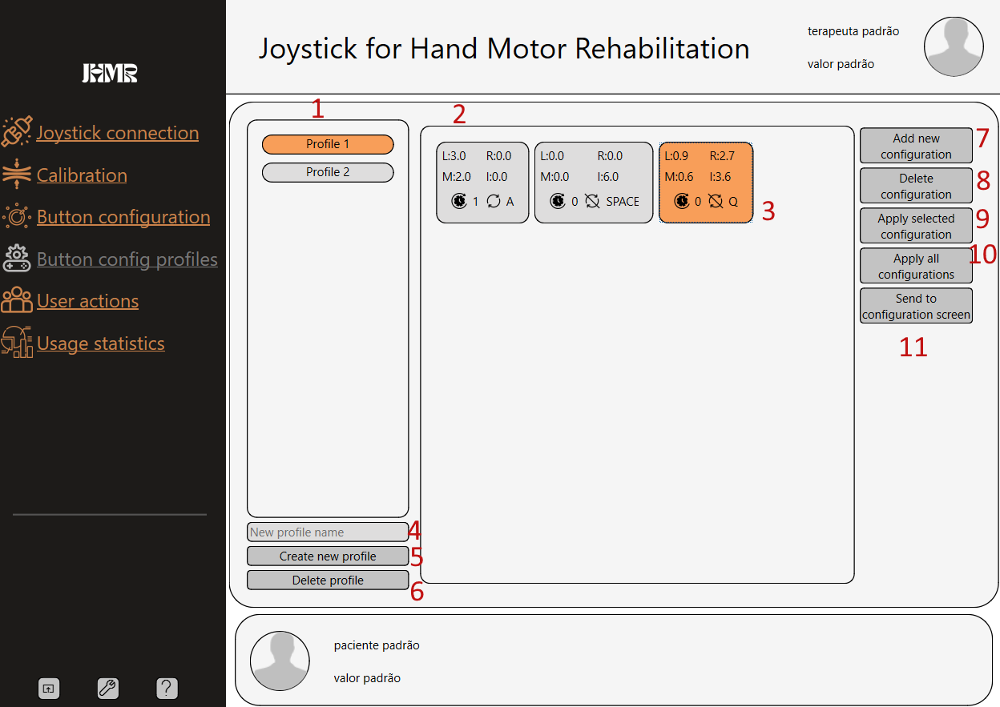

The image above presents the screen with it's main elements numbered. 

1. Configuration profile
   1. Stored profiles will appear on this list.
   2. Profiles are patient exclusive and are not shared between one another.
   3. Stores the configurations shown on the configuration list (item 2).
   4. To add a profile, type a name on the text field (item 4) and click on the add profile button (item 5).
   5. To select a profile, click on it.
2. Configuration list
   1. Configurations that have been added to the profile.
   2. To select one, click on it.
3. Selected configuration
   1. The background becomes orange.
   2. The information that this icons represent is discussed further.
4. Text field
   1. Used to name a profile.
   2. 32 character limit.
   3. Obligatory.
5. "Create new profile" Button
   1. Adds an empty profile.
6. "Remove profile" Button 
   1. Deletes the selected profile and the stored configurations.
7. "Add new configuration" Button
   1. Adiciona a última configuração realizada na tela de configurações ao perfil selecionado.
8. "Delete configuration" Button
   1. Removes the selected configuration from the profile.
9. "Apply selected configuration" Button
   1.  Sends the configuration to the joystick.
   3.  This is essencially the same action as configuring the joystick through the configuration screen.
10. "Apply all configurations" Button
   1.  Apply all the configurations stored on the profile.
11. Botão "Send to configuration screen"
    1.  Sends the parameters of the selected configuration to the configuration screen. 

Configurations from the item 2 are presented in the image below. 

   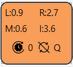

From right to left, the informations presented are:
   
1. Pressure associated with each finger.
   1. Fingers are denoted by their initials. 
2. Pressure duration
   1. Continous pressure duration, measured in seconds.
3. Repetition
   1. This icon represents the repetion parameter state, either on or off.
4. Selected key
   1. The key that was associated with this exercise.

Use:

1. Configure the joystick on the configuration screen.
2. Access the "Button config profiles" screen.
3. Create a new profile.
4. Select the created profile.
5. Use the button 7 to add the last configuration to the profile.
6. Repeat the process to add more configurations.

Now we have a profile with multiple configurations. 
At any other moment we wish to apply the same configuration to the joystick:

1. Select the desired profile.
2. Select the desired configuration.
3. Use the button 9 to apply them selected configuration.
4. Or use the button 10 to apply all the configuration.

## User actions
Patient and therapist registration.

Currently, we give special attention to patient registration. **There are two main characteristics.**
1. Its completely independent from the active therapist.
2. Its use to store and show the [use statistics sessions](#user-statistics) and [configuration profile](#Game-config-profile).

   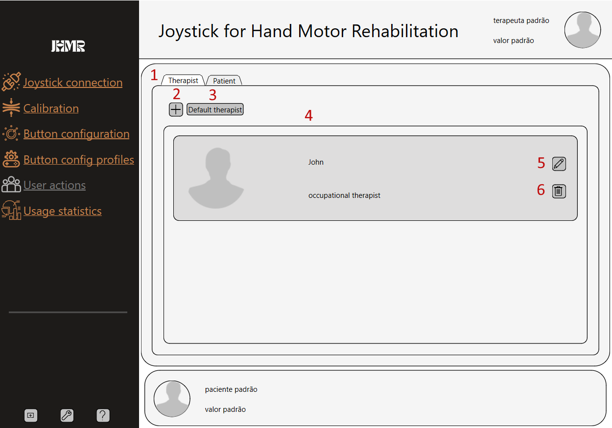

The image above represent the user actions screen with it's main elements numbered. 

1. Tab selection
   1. This button allows the user to change between the management of therapist and patient.
2. New registration
   1. Opens a registration dialog.
   2. After successful registration, patients and therapists will appear on their respective lists.
3. Default Therapist/Patient 
   1. The tool has default profiles for patient and therapist.
   2. Generic values that can be used by any user.
   3. Similar to a "guest" user function present in multiple websites and softwares.
   4. Use this button to return to the default value.
4. Registration list
   1. Registered patients and therapist will apear on their respective lists.
   2. They are selectable by clicking.
5. Edit registration
   1. Information can be altered for each registration individualy.
6. Remove registration
   1. Delete the selected registration.
   2. In case of a patient registration, all it's sessions and configuration profiles will be removed.

The following sequence of images demonstrates the step by step of registering a patient. The same process can used to register a therapist. 

   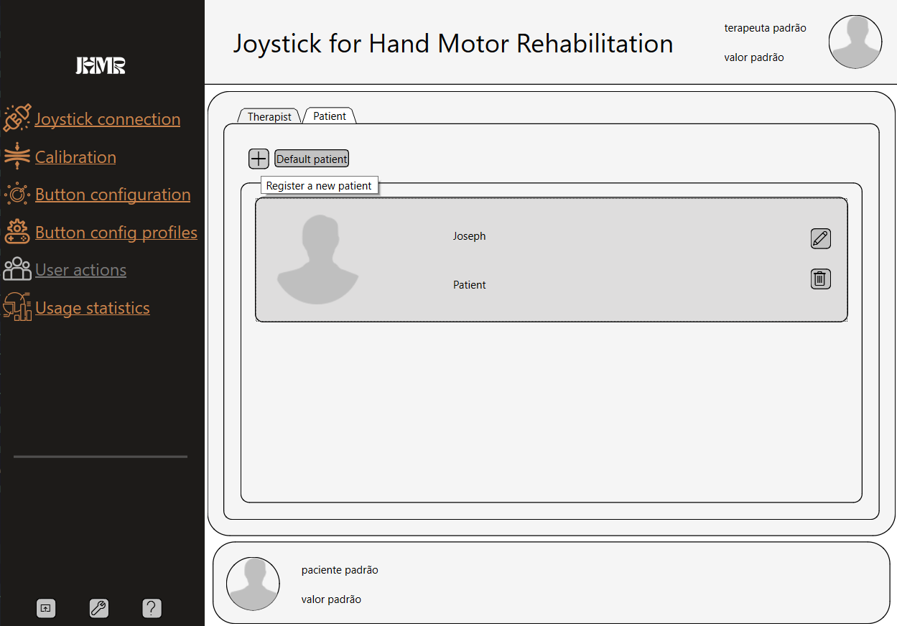   

   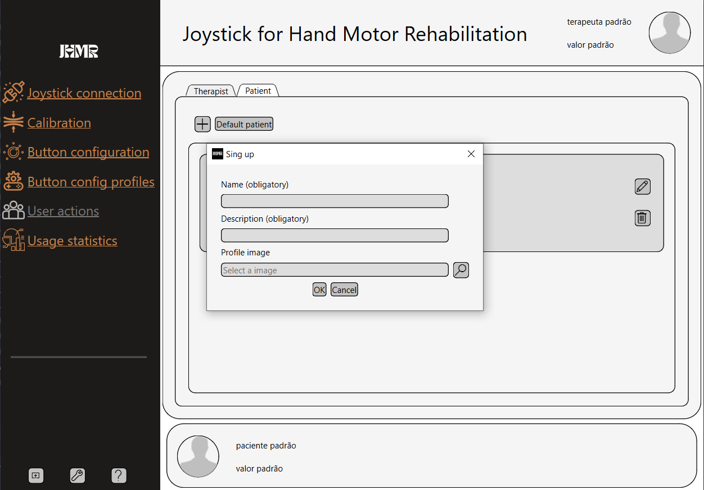   

   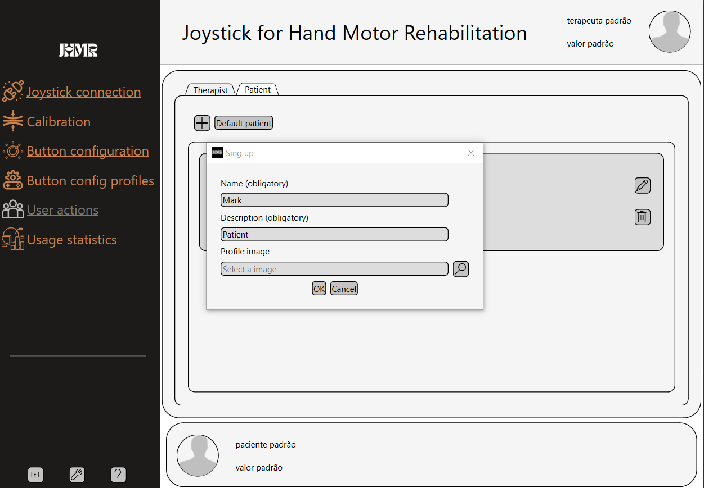   

   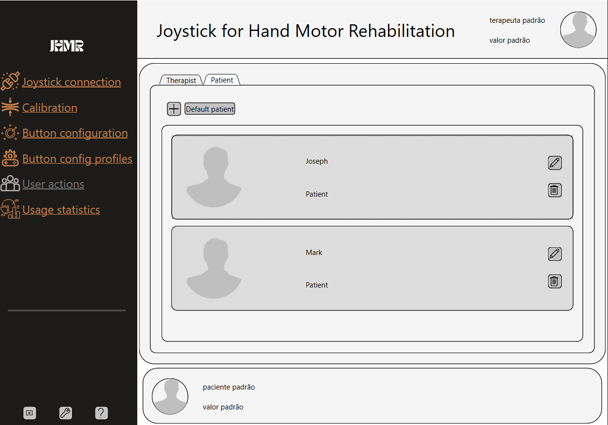   

   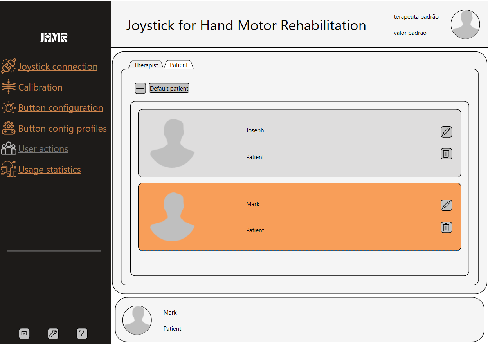   

Note that, on the lower half of the tool, it presents the currently selected patient.

## User statistics
This screen is used to obtain and monitor joystick use statistics during treatment, allowing the therapist to have a clear vision of the patients progress through out the treatment. 

It features two main tabs, session and summary. 
1. The session tab visually presents information about the current or latest session using graphs. Also has session controls, allowing for the creating and removal of sessions and data exporting.
2. The summary tab presents a summary of all recorded sessions for a patient, showing the progress thought the treatment. 

   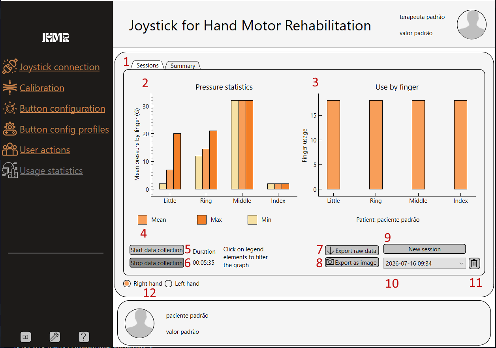 

The image above presents the screen with it's main elements numbered. 

1. Tab selector
   1. These buttons allow the user to swap between the summary and session tabs.
2. Pressure statistics graph
   1. Presents statistical information about the pressure values collected in the current session.
3. Finger use graph
   1. Presents the total number of uses of each finger in the current session.
4. Interactive legend
   1. It's possible to filter the graph by clicking the legend elements.
5. "Start data collection" button
   1. Sends a message to the joystick, after receiving it, it will transmit pressure information.
   2. Blocks all other functions.
   3. Data can only be obtained using this button.
6. "Stop data collection" button
   1. Stops the data collection.
   2. Unblocks all other functions.
7. "Export raw data" button
   1. Data from every graph are exported to multiple CSV files.
   2. Files are saved on the root tool's root folder, the same folder from the executable.
   3. Folders are separated by patients.
8. "Export as image" button
   1. Two images are generated, on the same folder structure used by the "export raw data" button.
   2. The images represent the graphs from the session and summary tabs.      
9. "New session" button
   1.  Create a new empty session, using the current date information.
10. Session selector
   1. A list presenting all the sessions.
   2. Sessions are separated by moment of creation, multiple sessions can be created in the same day.
   3. Naming scheme: Year-month-day hour:minute
11. "Delete session" button
    1. Deletes the current session and all it's data.  
12. Hand selector
    1. Select the desired hand for the current session.
    2. Graphs from the session and summary tabs will reflect this choice.

Important details
1. Graphs are not updatedd in real time. The user needs to stop collecting data from the joystick.
2. Session and summary are separated by selected hand. While collecting and selecting data, only the selected hand is considered.

The image sequence below presents the various states for this screen. 

During the collection of data.

   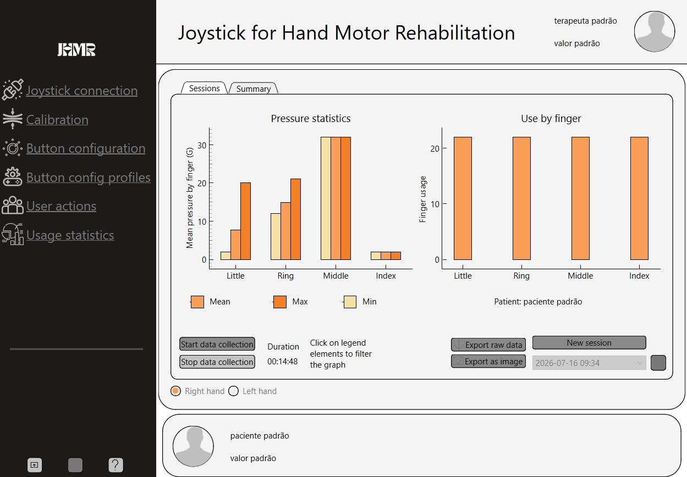

Summary tab.

   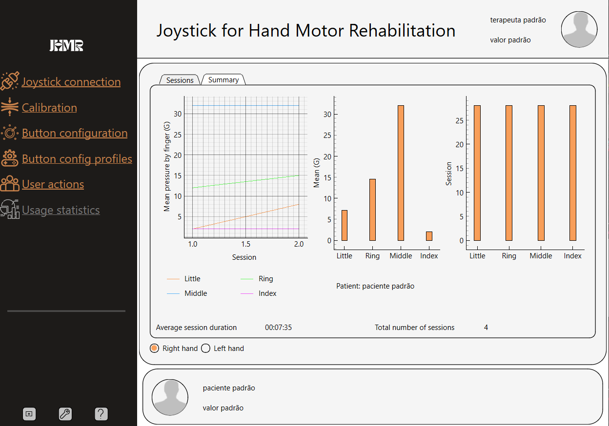

Summary tab, with filtered graph.

   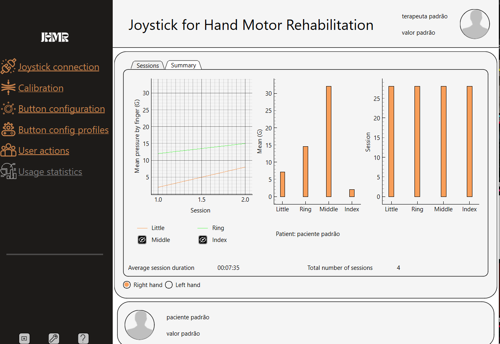

Session tab with filtered graph.

   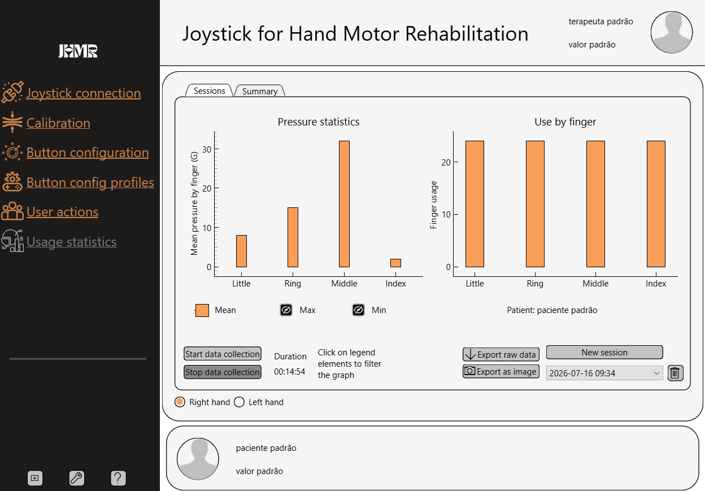

